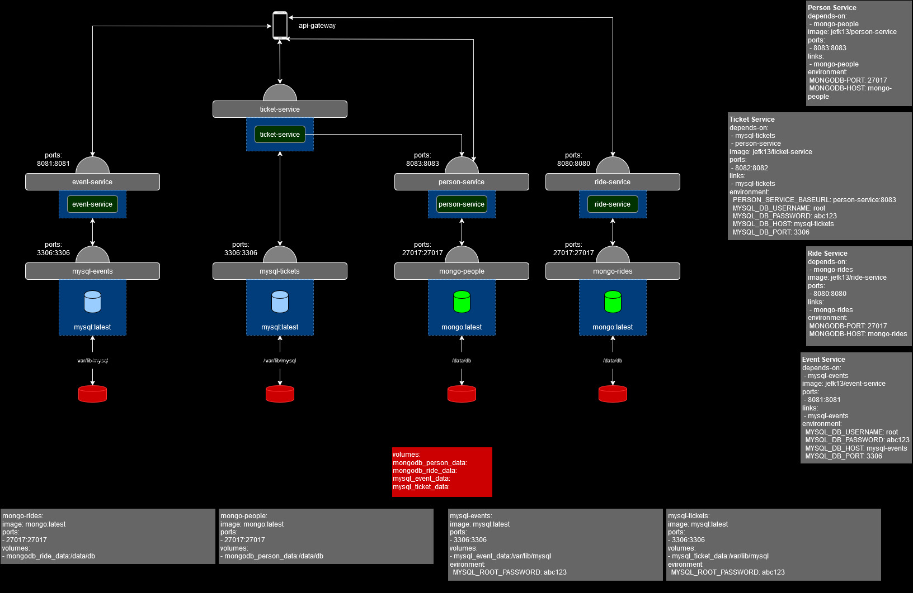
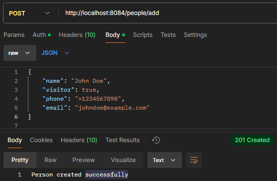
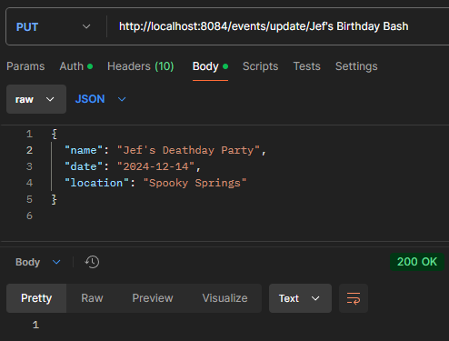

# APT Project by Jef Keppens and Sen Dewael
Course: Advanced Programming Topics  

Class: 3APP01  

Students: Jef Keppens & Sen Dewael  

## Theme: Amusement Park
Our project revolves around the theme of an amusement park.
- **People**: A park is attended by people. They have a name, a phone number and an email. A person can be a visitor or a staff member.
- **Rides**: An amusement park has multiple rides people can go on. Each ride has its own name, and can be of a certain type such as "Rollercoaster". A ride also has a capacity limit and takes a certain amount of time.
- **Events**: Special events can be hosted. Such as a Halloween event. The event takes place on a certain date and a specific location in the park.
- **Tickets**: People are able to get tickets. For the park itself or for a specific event. A ticket has a number, is bought on a specific date and always belongs to the person who bought it.

## Microservices & Components
### Microservices:
- Person
  -   Port: 8083
  -   DB: mongo-people
- Ride
  -   Port: 8080
  -   DB: mongo-rides
- Event
  -   Port: 8081
  -   DB: mysql-events
- Ticket
  -   Port: 8082
  -   DB: mysql-tickets
### Other components:
- API gateway (Access to all microservices)
  - Port: 8084
### Deployment diagram:

## Extra's
### Front-end:
Connects to API gateway to access microservices.
- Port: 8085
- Runs in Docker container
## Functional endpoints (Postman)
### Person (auth. needed for all endpoints):
#### Create:

#### Get all:

#### Update:

#### Delete:

### Ride (auth. needed for create, update, delete):
#### Create:

#### Get all:

#### Update:

#### Delete:

### Event (auth. needed for create, update, delete):
#### Create:

#### Get all:

#### Update:

#### Delete:

### Ticket (auth. needed for all endpoints):
#### Create:

#### Get all:

#### Update:

#### Delete:

